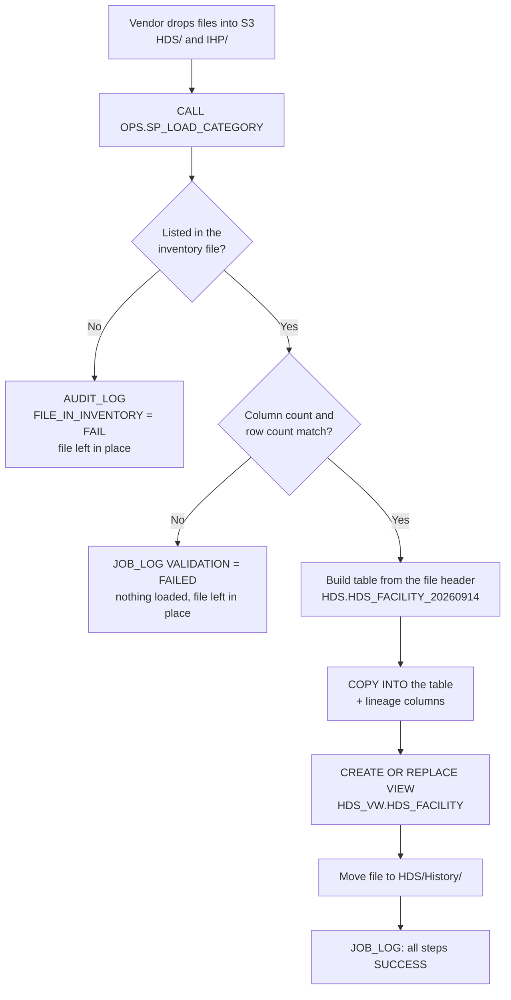

# Reference Data System (RDS)


A metadata-driven reference data pipeline on **Snowflake + AWS S3**, rebuilding a legacy **Netezza + DataStage** workflow with no ETL server and no per-file jobs.

Vendors drop data files and an inventory (manifest) file into S3. One stored procedure validates every file against that inventory, loads the good ones into date-stamped tables, republishes a clean view over the latest load, archives the file so it is never loaded twice, and records every check and every step in audit and job logs.

---

## Why this exists

| Legacy (Netezza + DataStage) | This project (Snowflake + S3) |
|---|---|
| Samba share for file delivery | S3 bucket with per-category folders |
| One DataStage job per file | One generic stored procedure driven by the inventory |
| Manual checks scattered across jobs | Four automated checks, every run |
| Job history inside the ETL tool | `OPS.JOB_LOG` and `OPS.AUDIT_LOG`, queryable in SQL |
| Reloads risk duplicating data | Loaded files move to `History/`, so re-runs are safe |

---

## How it works



### The four validation checks

| Check | Measured from | Compared against |
|---|---|---|
| `FILE_IN_INVENTORY` | File present in the category folder | `FILE_NM` in the inventory |
| `COLUMN_COUNT` | Header line of the file | `COL_CNT` |
| `ROW_COUNT` | `COUNT(*)` over the staged file | `ROW_CNT` |
| `ROWS_LOADED` | `rows_loaded` returned by `COPY INTO` | `ROW_CNT` |

A file only loads when every check passes. Anything else is logged and left in the folder for correction, and the previously published view keeps serving the last good data.

### Table and view naming

The file name carries the load date; the view drops it and always points at the newest table.

```
HDS_FACILITY_20260914.csv  ──►  table  RDS_DB.HDS.HDS_FACILITY_20260914
                           ──►  view   RDS_DB.HDS_VW.HDS_FACILITY
```

| Event | View points to |
|---|---|
| Load `HDS_FACILITY_20260914.csv` | `HDS_FACILITY_20260914` |
| Load `HDS_FACILITY_20260915.csv` | `HDS_FACILITY_20260915` |
| Reload the older 20260914 file | still `HDS_FACILITY_20260915` |

Every dated table is kept, so any past load stays queryable for audit.

---

## Repository structure

```
RDS/
├── PLAN/
│   └── 01-Snowflake_setup.sql        Roles, warehouse, database, schemas, grants
├── DDL/
│   ├── TABLES/
│   │   └── 01_ops_log_tables.sql     OPS.JOB_LOG, OPS.AUDIT_LOG
│   └── VIEWS/
│       └── 01_ops_monitoring_views.sql  Load summary, failed checks, view sources
├── DB_CODE/
│   └── STORE_PROCEDURE/
│       └── SP_LOAD_CATEGORY.sql      File format + the validate-load-publish procedure
└── DATA/
    ├── RDS_Inventory_HDS.csv         Manifest: file name, column count, row count, date, owner
    ├── RDS_Inventory_IHP.csv
    ├── HDS_FACILITY_20260914.csv     Sample: 12 columns, 20 rows
    └── IHP_HEALTH_PLAN_20260914.csv  Sample: 13 columns, 18 rows
```

---

## Snowflake objects

| Schema | Purpose |
|---|---|
| `OPS` | Control layer: stage, file formats, logs, monitoring views, stored procedure |
| `HDS` | Hospital Delivery System — one date-stamped table per loaded file |
| `IHP` | Insurance Health Plan — one date-stamped table per loaded file |
| `HDS_VW` | Consumption views over the latest HDS load |
| `IHP_VW` | Consumption views over the latest IHP load |

| Role | Access |
|---|---|
| `RDS_ADMIN` | Owns and builds everything |
| `RDS_READER` | Reads the `*_VW` schemas only |

Warehouse `RDS_WH` is XSMALL with a 60-second auto-suspend.

---

## Getting started

**Prerequisites:** a Snowflake account, an AWS account with an S3 bucket, and the bucket connected to Snowflake through a storage integration or stage credentials.

**1. Create the Snowflake foundation**
```sql
-- PLAN/01-Snowflake_setup.sql
-- roles, warehouse, RDS_DB, schemas OPS / HDS / IHP / HDS_VW / IHP_VW, grants
```

**2. Create the external stage and file formats** in `RDS_DB.OPS`, pointing at the bucket (`FF_CSV_HEADER`, `FF_CSV_LINE`, plus `FF_CSV_INFER` from the procedure script).

**3. Create the log tables and monitoring views**
```sql
-- DDL/TABLES/01_ops_log_tables.sql
-- DDL/VIEWS/01_ops_monitoring_views.sql
```

**4. Create the procedure**
```sql
-- DB_CODE/STORE_PROCEDURE/SP_LOAD_CATEGORY.sql
```

**5. Upload files to S3 and run the load**
```sql
CALL RDS_DB.OPS.SP_LOAD_CATEGORY('HDS');
CALL RDS_DB.OPS.SP_LOAD_CATEGORY('IHP');
```

The procedure returns a summary:
```json
{
  "category": "HDS",
  "files_found": 1,
  "files_loaded": 1,
  "files_failed": 0,
  "files_not_in_inventory": 0,
  "files_missing": 0,
  "job_run_id": "…"
}
```

---

## Inventory file format

Each category folder holds one inventory file listing what the vendor sent:

```csv
FILE_NM,COL_CNT,ROW_CNT,DATE,OWNER
HDS_FACILITY_20260914.csv,12,20,2026-09-14,HDS_REF_DATA_TEAM
```

| Column | Meaning |
|---|---|
| `FILE_NM` | Exact file name, case-sensitive |
| `COL_CNT` | Number of columns in the header |
| `ROW_CNT` | Data rows, header excluded |
| `DATE` | Business date of the file |
| `OWNER` | Team responsible for the data |

---

## Monitoring

```sql
-- One row per file per run: validation, load, view and archive status
SELECT * FROM RDS_DB.OPS.VW_LOAD_SUMMARY ORDER BY START_TS DESC;

-- Only the checks that failed, with expected vs actual
SELECT * FROM RDS_DB.OPS.VW_FAILED_CHECKS;

-- Which dated table each consumption view currently serves
SELECT * FROM RDS_DB.OPS.VW_CURRENT_VIEW_SOURCE;
```

`JOB_LOG` records one row per step (`VALIDATION`, `TABLE_LOAD`, `VIEW_REFRESH`, `ARCHIVE`, `FILE_MISSING`); `AUDIT_LOG` records one row per check with expected and actual values. Both share a `JOB_RUN_ID` per run.

---

## Roadmap

- [ ] Schedule the procedure with Snowflake Tasks for hands-off daily loads
- [ ] Email alerts on validation failures and missing files
- [ ] `Rejected/` folder for files that fail validation repeatedly
- [ ] Retention policy for old dated tables
- [ ] dbt models on top of the consumption views

---

## Notes

All data in `DATA/` is **synthetic sample data** created for testing. It contains no real patient, provider or member information.

**Author:** Pravinsingh Rajput
